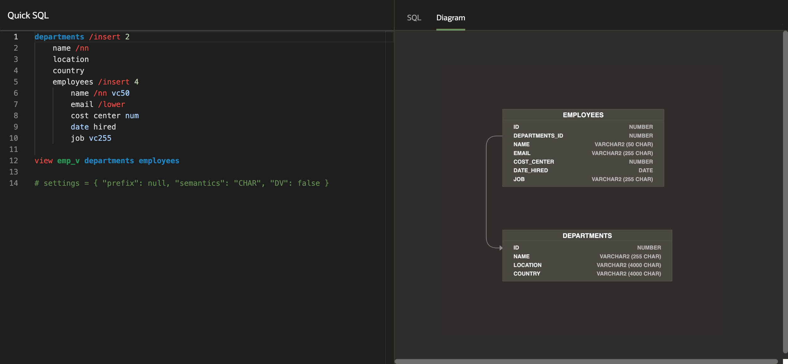

# Quick SQL <!-- omit in toc -->

## Table of Contents <!-- omit in toc -->

- [Overview](#overview)
- [Installation](#installation)
- [Building Locally](#building-locally)
- [Running Tests](#running-tests)
- [Running the Example CLI](#running-the-example-cli)
- [Translating Quick SQL into Oracle SQL Data Definition Language (DDL)](#translating-quick-sql-into-oracle-sql-data-definition-language-ddl)
    - [DDL NodeJS ECMA Script Module (ESM) Example](#ddl-nodejs-ecma-script-module-esm-example)
    - [DDL NodeJS Common JS (CJS) Example](#ddl-nodejs-common-js-cjs-example)
    - [DDL Browser ECMA Script Module (ESM) Example](#ddl-browser-ecma-script-module-esm-example)
    - [DDL Browser Universal Module Definition (UMD) Example](#ddl-browser-universal-module-definition-umd-example)
- [Transforming Quick SQL into an Entity-Relationship Diagram (ERD)](#transforming-quick-sql-into-an-entity-relationship-diagram-erd)
- [Contributing](#contributing)
- [Security](#security)
- [License](#license)

## Overview

Quick SQL is a markdown-like shorthand syntax that expands to standards-based
Oracle SQL. It is useful to rapidly design and prototype data models. Take a
look at the example below:


Previously, Quick SQL was only available within Oracle Application Express. This
project reimplements the Quick SQL parser and translator into a JavaScript
library which can be used in both NodeJS and the browser.

This repository also includes a Quick SQL to Entity Relationship Diagram
module that can be used as seen in the example below:



## Installation

1. Open a terminal window
2. Clone the repository
3. Change into the cloned repository directory
4. Install dependencies by running

    ```bash
    npm install
    ```

## Building Locally

Once you have set up the project, you can build the library by executing:

```bash
npm run build
```

## Running Tests

Once you have set up the project, you can run the test suite by executing:

```bash
npm run test
```

## Running the Example CLI

Once you have built the library, you can run the example CLI by executing:

```bash
npm run example-cli -- ./test/department_employees.quicksql
```

## Translating Quick SQL into Oracle SQL Data Definition Language (DDL)

The Quick SQL to DDL translator is the product's core component, It allows users
to transform a Quick SQL string into an Oracle SQL string.

The Quick SQL Syntax and Grammar are documented [here](./quick-sql-grammar.md)

See below for examples of how to use this library.

### DDL NodeJS ECMA Script Module (ESM) Example

```js
import quickSQL from "./dist/quick-sql.js";
import fs from "fs";

try {
    const text = fs.readFileSync( './test/department_employees.quicksql' );
    console.log( quickSQL.toDDL( text.toString() ) );
} catch( e ) {
    console.error( e );
};
```

### DDL NodeJS Common JS (CJS) Example

```js
const quickSQL  = require( "./dist/quick-sql.umd.cjs" );
const fs = require( "fs" );

try {
    const text = fs.readFileSync( './test/department_employees.quicksql' );
    console.log( quickSQL.toDDL( text.toString() ) );
} catch( e ) {
    console.error( e );
};
```

### DDL Browser ECMA Script Module (ESM) Example

```html
<script type="module">
    import quickSQL from './dist/quick-sql.js';
    document.body.innerText = quickSQL.toDDL(
`departments /insert 2
    name /nn
    location
    country
    employees /insert 4
        name /nn vc50
        email /lower
        cost center num
        date hired
        job vc255

view emp_v departments employees

# settings = { "prefix": null, "semantics": "CHAR", "DV": false }

`
    );
</script>
```

### DDL Browser Universal Module Definition (UMD) Example

```html
<script src="./dist/quick-sql.umd.cjs"></script>
<script>
    document.body.innerText = quickSQL.toDDL(
`departments /insert 2
    name /nn
    location
    country
    employees /insert 4
        name /nn vc50
        email /lower
        cost center num
        date hired
        job vc255

view emp_v departments employees

# settings = { "prefix": null, "semantics": "CHAR", "DV": false }

`
    );
</script>
```

## Transforming Quick SQL into an Entity-Relationship Diagram (ERD)

Requires a paid library. Review the usage [here](./erd.md)

## Contributing

This project welcomes contributions from the community. Before submitting a pull
request, please [review our contribution guide](./CONTRIBUTING.md)

## Security

Please consult the [security guide](./SECURITY.md) for our responsible security
vulnerability disclosure process

## License

Copyright (c) 2023 Oracle and/or its affiliates.

Released under the Universal Permissive License v1.0 as shown at
<https://oss.oracle.com/licenses/upl/>.
