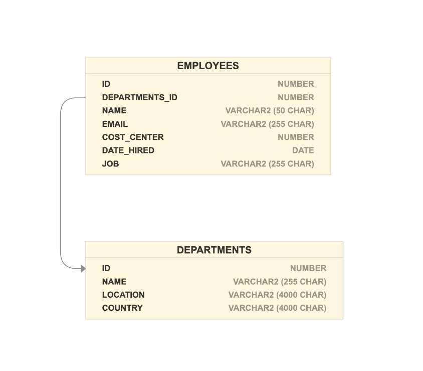
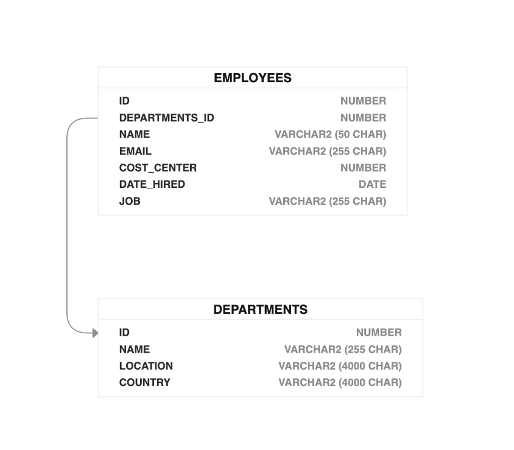
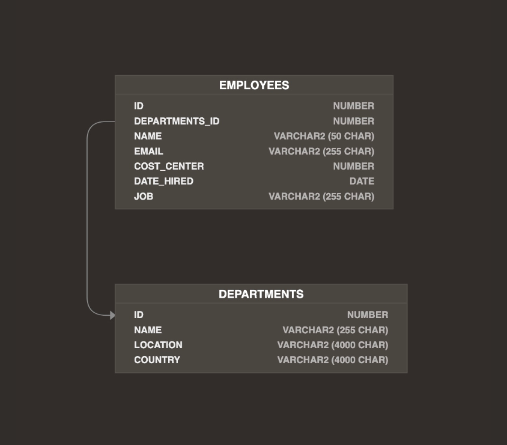

# Quick ERD <!-- omit in toc -->

Used to transform Quick SQL into an Entity-Relationship Diagram (ERD)

## Table of Contents <!-- omit in toc -->

- [Prerequisites](#prerequisites)
- [ERD Browser ESM Example](#erd-browser-esm-example)
- [ERD Browser UMD Example](#erd-browser-umd-example)
- [ERD Theming](#erd-theming)

## Prerequisites

You need to add the following dependencies to your HTML:

- JointJS+ v3.5.0 (Requires a paid License). This requires the following
    dependencies (See the [JointJS+
    Documentation](https://resources.jointjs.com/docs/rappid/v3.5/index.html)):

    - jQuery
    - lodash
    - Backbone JS
    - graphlib
    - dagre

## ERD Browser ESM Example

<!-- markdownlint-disable MD013 -->
```html
<!DOCTYPE html>
<html>
    <head>
        <meta charset="UTF-8">
        <meta name="viewport" content="width=device-width, initial-scale=1.0">
        <title>Quick ERD</title>

        <!-- Assuming you put the rappid.min.css file in this path -->
        <link rel="stylesheet" type="text/css" href="./examples/diagram-generator/libs/rappid.min.css">
        <link rel="stylesheet" href="./dist/quick-erd.css">

        <style>
            html, body {
                height: 100%;
                margin: 0;
            }
            #quickERD {
                width: 100%;
                height: 100%;
            }
        </style>
    </head>
    <body>
        <div id="quickERD"></div>

        <script src="https://cdn.jsdelivr.net/npm/jquery@3.7.1/dist/jquery.min.js" integrity="sha256-/JqT3SQfawRcv/BIHPThkBvs0OEvtFFmqPF/lYI/Cxo=" crossorigin="anonymous"></script>
        <script src="https://cdn.jsdelivr.net/npm/lodash@4.17.21/lodash.min.js" integrity="sha256-qXBd/EfAdjOA2FGrGAG+b3YBn2tn5A6bhz+LSgYD96k=" crossorigin="anonymous"></script>
        <script src="https://cdn.jsdelivr.net/npm/backbone@1.5.0/backbone-min.min.js"></script>
        <script src="https://cdn.jsdelivr.net/npm/graphlib@2.1.8/dist/graphlib.core.min.js"></script>
        <script src="https://cdn.jsdelivr.net/npm/dagre@0.8.5/dist/dagre.core.min.js"></script>

        <!-- Assuming you put the rappid.min.js file in this path -->
        <script src="./examples/diagram-generator/libs/rappid.min.js"></script>

        <script type="module">
            import { toERD } from './dist/quick-sql.js';
            import { Diagram  } from './dist/quick-erd.js';

            new Diagram( toERD(
`
departments
    name /nn
    location
    country
employees
    departments_id /fk departments
    name /nn vc50
    email /lower
    cost center num
    date hired
    job vc255

view emp_v departments employees

# settings = { "prefix": null, "semantics": "CHAR", "DV": false }

`
            ), '#quickERD' );
        </script>
    </body>
</html>
```
<!-- markdownlint-enable MD013 -->

## ERD Browser UMD Example

<!-- markdownlint-disable MD013 -->
```html
<!DOCTYPE html>
<html>
    <head>
        <meta charset="UTF-8">
        <meta name="viewport" content="width=device-width, initial-scale=1.0">
        <title>Quick ERD</title>

        <!-- Assuming you put the rappid.min.css file in this path -->
        <link rel="stylesheet" type="text/css" href="./examples/diagram-generator/libs/rappid.min.css">
        <link rel="stylesheet" href="./dist/quick-erd.css">

        <style>
            html, body {
                height: 100%;
                margin: 0;
            }
            #quickERD {
                width: 100%;
                height: 100%;
            }
        </style>
    </head>
    <body>
        <div id="quickERD"></div>

        <script src="https://cdn.jsdelivr.net/npm/jquery@3.7.1/dist/jquery.min.js" integrity="sha256-/JqT3SQfawRcv/BIHPThkBvs0OEvtFFmqPF/lYI/Cxo=" crossorigin="anonymous"></script>
        <script src="https://cdn.jsdelivr.net/npm/lodash@4.17.21/lodash.min.js" integrity="sha256-qXBd/EfAdjOA2FGrGAG+b3YBn2tn5A6bhz+LSgYD96k=" crossorigin="anonymous"></script>
        <script src="https://cdn.jsdelivr.net/npm/backbone@1.5.0/backbone-min.min.js"></script>
        <script src="https://cdn.jsdelivr.net/npm/graphlib@2.1.8/dist/graphlib.core.min.js"></script>
        <script src="https://cdn.jsdelivr.net/npm/dagre@0.8.5/dist/dagre.core.min.js"></script>

        <!-- Assuming you put the rappid.min.js file in this path -->
        <script src="./examples/diagram-generator/libs/rappid.min.js"></script>

        <script src="./dist/quick-sql.umd.cjs"></script>
        <script src="./dist/quick-erd.umd.cjs"></script>

        <script>
            new quickERD.Diagram( quickSQL.toERD(
`
departments
    name /nn
    location
    country
employees
    departments_id /fk departments
    name /nn vc50
    email /lower
    cost center num
    date hired
    job vc255

view emp_v departments employees

# settings = { "prefix": null, "semantics": "CHAR", "DV": false }

`
            ), '#quickERD' );
        </script>
    </body>
</html>
```
<!-- markdownlint-enable MD013 -->

## ERD Theming

By default, the diagram uses a neutral color scheme as per below:



However, the diagram can be themed using CSS variables as shown in the example below:

```css
/* Light Theme */
:root {
    --qs-diagram-table-background-color: #FFF;
    --qs-diagram-font-family: var(--a-base-font-family, sans-serif);
    --qs-diagram-table-border-color: #f1efed;
    --qs-diagram-table-name-text-color: rgb(22 21 19);
    --qs-diagram-table-column-text-color: rgba(22, 21, 19, .9);
    --qs-diagram-table-data-type-text-color: rgba(22, 21, 19, .5);
    --qs-diagram-table-separator-color: #e7e3e1;
}
/* Dark Theme */
@media (prefers-color-scheme: dark) {
    :root {
        --qs-diagram-table-background-color: #4a4541;
        --qs-diagram-font-family: var(--a-base-font-family, sans-serif);
        --qs-diagram-table-border-color: #55504c;
        --qs-diagram-table-text-color: #fcfbfa;
        --qs-diagram-table-name-text-color: white;
        --qs-diagram-table-column-text-color: rgb(255 255 255 / 90%);
        --qs-diagram-table-data-type-text-color: rgb(255 255 255 / 60%);
        --qs-diagram-table-separator-color: #55504c;
    }
}
```

Which would produce the following:

- Light Color Scheme

    

- Dark Color Scheme

    
